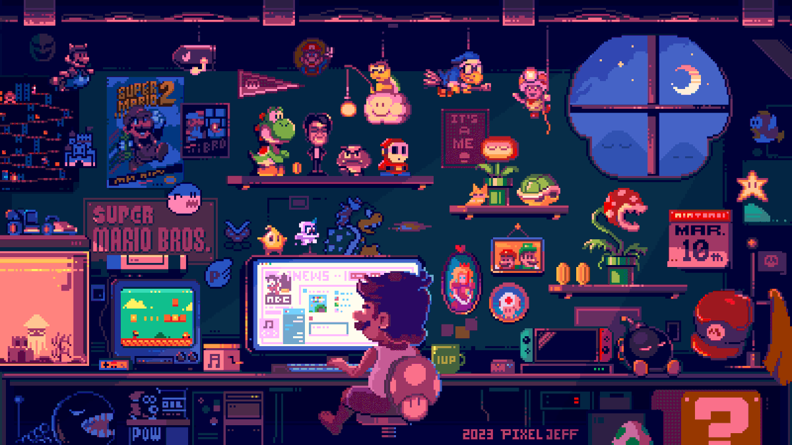
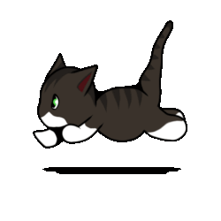

  

 

### 🧑‍💻 About me

Professional <b>Software Engineer</b> focused on building <b>robust, scalable backend systems</b>.  
I enjoy working on <b>system architecture, performance optimization, and cloud infrastructure</b>.

<ul>
  <li>💻 <b>Experience:</b> Backend Development & Cloud Infrastructure (Azure)</li>
  <li>🚀 <b>Focus:</b> Scalable APIs, system design, distributed systems</li>
  <li>🎯 <b>Goal:</b> Open-source contribution & mentoring junior developers</li>
  <li>📫 <b>Connect:</b>
    <a href="https://ndmthuan97.github.io">Portfolio</a> |
    <a href="https://www.linkedin.com/in/ndmthuan97">LinkedIn</a> |
    <a href="mailto:ndmthuan.97@gmail.com">Email</a>
  </li>
</ul>

 

# 🛠️ Technologies

  

  

# 📊 GitHub Stats

 

  

